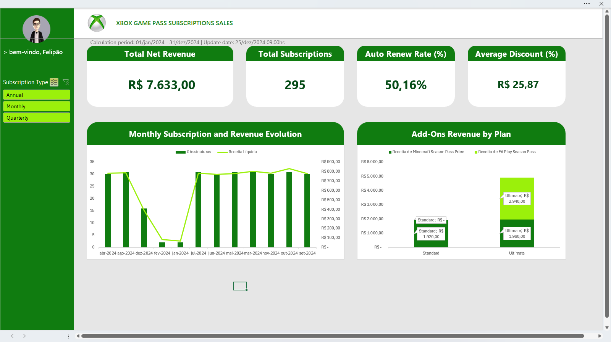

# Xbox Game Pass Dashboard

  
  

Um dashboard interativo em Excel 365 (PT-BR) que consolida dados de assinaturas, receitas e use-cases de add-ons, com KPIs, gráficos e slicers alinhados à identidade Xbox.

---

---

## Sumário

1. [Visão Geral](#-visão-geral)  
2. [Estrutura de Pastas](#-estrutura-de-pastas)  
3. [Pré-requisitos](#-pré-requisitos)  
4. [Instalação e Setup](#-instalação-e-setup)  
5. [Tabela de Suporte (Aba “Cálculos”)](#-tabela-de-suporte-aba-cálculos)  
6. [PivotTables](#-pivottables)  
7. [Slicers & Timeline](#-slicers--timeline)  
8. [KPI Cards (Top 4 Big Numbers)](#-kpi-cards-top-4-big-numbers)  
9. [Gráficos Principais](#-gráficos-principais)  
10. [Identidade Visual](#-identidade-visual)
11. [Download](#download)
12. [Contribuições](#-contribuições)  
13. [Licença](#-licença)  

---

## 📝 Visão Geral

- **Objetivo**: Analisar performance de assinaturas Game Pass por plano, evolução mensal, taxa de renovação, receita de add-ons e impacto de cupons.  
- **Ferramenta**: Microsoft Excel 365 (PT-BR)  
- **Formato**: `.xlsx` – Pivots, fórmulas GETPIVOTDATA, slicers.  

---

## 📁 Estrutura de Pastas
Usando o padrão de organização de abas ( ABCDE ), onde:
- **A > Assets**: Aba contendo as imagens, códigos de cores, descrição de fontes usadas.
- **B > Base**: Aba contendo a tabela com os dados em si.
- **C > Calculation**: Aba contendo as cálculos necessários, como tabelas dinâmicas, etc...
- **D > Dashboad**: Aba contendo o dashboard em si.
- **E > Extras**: Aba contendo qualquer outra coisa que não caiba nas demais categorias.

---

## 🔧 Pré-requisitos

1. Microsoft Excel 365 em Português (Brasil).  
2. Git (se for versionar no GitHub).

---

## 🚀 Instalação e Setup

1. Clone ou baixe este repositório.  
2. Abra `Dashboard.xlsx` no Excel 365.  

---

## 🗂️ Tabela de Suporte (Aba “Cálculos”)

| Coluna             | Fórmula / Descrição                                                                            |
|--------------------|------------------------------------------------------------------------------------------------|
| Gross Revenue      | `=SOMA([Subscription Price];[@[EA Play Season Pass Price]];[@[Minecraft Season Pass Price]])`   |
| Total AddOns       | `=SOMA([@[EA Play Season Pass Price]];[@[Minecraft Season Pass Price]])`                       |
| Month/Year         | `=TEXTO([@[Start Date]];"mmm-aaaa")`                                                            |
| Auto Renew Flag    | `=SE([@[Auto Renewal]]="Yes";"Auto-Renew";"Manual")`                                            |
| HasEAPlay (aux.)   | `=SE([@[EA Play Season Pass Price]]>0;1;0)`                                                     |
| HasMinecraft (aux.)| `=SE([@[Minecraft Season Pass Price]]>0;1;0)`                                                   |

---

## 📊 PivotTables

| Nº   | Exibição                                   | Nome Técnico                            |
|------|--------------------------------------------|-----------------------------------------|
| 1    | Receita Líquida por Plano (% do total)     | `pvt_ReceitaLiquidaPorPlano`            |
| 2    | Evolução Mensal de Assinaturas e Receita   | `pvt_EvolucaoMensalAssinaturasReceita`  |
| 3    | Taxa de Auto-Renew e Receita               | `pvt_TaxaAutoRenewReceita`              |
| 4.1  | Receita EA Play por Plano                  | `pvt_ReceitaEAPlayPorPlano`             |
| 4.2  | Receita Minecraft por Plano                | `pvt_ReceitaMinecraftPorPlano`          |
| 5    | Impacto de Cupons por Plano                | `pvt_ImpactoCuponsPorPlano`             |
| 6    | Add-Ons por Plano (EA Play + Minecraft)    | `pvt_AddOnsPorPlano`                    |

---

## 🎛️ Slicers & Timeline

- **Subscription Type** (`Annual`, `Monthly`, `Quarterly`)  

---

## 📈 KPI Cards (Top 4 Big Numbers)

Cada card é uma forma vinculada a uma célula de apoio com `GETPIVOTDATA` (no Excel PT-BR: `INFODADOSTABELADINÂMICA`):

| Cartão                  | Célula Apoio | Exemplo de Fórmula                                                          |
|-------------------------|--------------|------------------------------------------------------------------------------|
| Total Receita Líquida   | `M18`        | `=INFODADOSTABELADINÂMICA("Total Value";Cálculos!$A$3)`                      |
| Total Assinaturas       | `M19`        | `=INFODADOSTABELADINÂMICA("Subscriber ID";Cálculos!$A$8)`                    |
| % Auto-Renew            | `M20`        | `=INFODADOSTABELADINÂMICA("% Assinaturas";Cálculos!$C$14)`                   |
| Média de Descontos      | `M21`        | `=INFODADOSTABELADINÂMICA("Média de Coupon Value";Cálculos!$E$22)`           |

---

## 📊 Gráficos Principais

1. **Evolução Mensal (Combo Coluna + Linha)**  
   - Colunas: `# Assinaturas` (Pivot 2)  
   - Linha: `Receita Líquida` (Pivot 2, eixo secundário)

2. **Receita de Add-Ons por Plano (Colunas Empilhadas)**  
   - Séries: `EA Play Season Pass Price` + `Minecraft Season Pass Price` (Pivot 6)

---

## 🎨 Identidade Visual

- **Fonte**: Segoe UI Semibold (títulos), Regular (eixos/legendas)  
- **Cores**:  
  - XboxPrimary: `#107C10`  
  - XboxSecondary: `#054B16`  
  - MenuPrimary: `#9BF00B`  
  - MenuSecondary: `#505050`  
  - Fundo geral: `#FFFFFF`; painéis de slicer: `#E6E6E6`  
- **Layout**: 8 colunas horizontais no topo, espaçamento de 20 px entre objetos.

---

## Download

Baixe a planilha em:  
[desafio_dio_dashboard_ver001_jun-25.xlsx](desafio_dio_dashboard_ver001_jun-25.xlsx)

---

## 🤝 Contribuições

1. Faça um *fork* deste repositório.  
2. Crie uma branch: `git checkout -b minha-melhoria`.  
3. Adicione sua feature ou correção.  
4. `git commit -m "Minha melhoria"`.  
5. `git push origin minha-melhoria`.  
6. Abra um *pull request*.

---

## 📄 Licença

Este projeto está licenciado sob [MIT License](LICENSE).  

